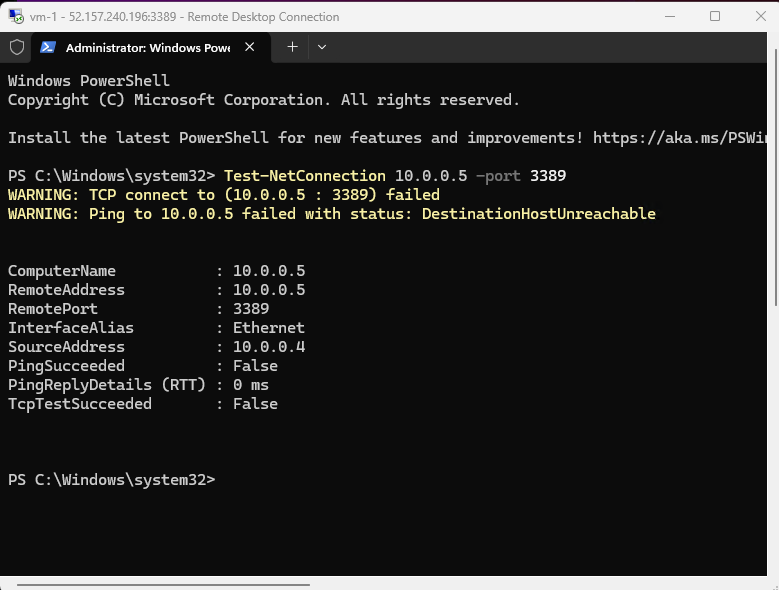

# IT Support Lab

Simulated IT support environment using **Active Directory**, **Jira Ticketing**, and **Azure Cloud Networking**.

---

## Scenario 1 – Sarah Jenkins (Account Disabled)
**Issue:** User unable to log in due to account being disabled.  
**Resolution:** Re-enabled the user account and verified login access.

**Evidence:**  
  

---

## Scenario 2 – Daniel Carter (Password Reset)
**Issue:** User unable to log in due to password issues.  
**Investigation:** Accessed Active Directory, located the user account.  
**Resolution:** Performed password reset and confirmed access.

**Evidence:**  
  
  

---

## Scenario 3 – Emma Singh (Account Related)
**Evidence:**  
  
  

---

## Scenario 4 – Azure VM Networking & ICMP Troubleshooting
**Objective:** Troubleshoot connectivity between two Azure VMs in different Virtual Networks using NSGs and Windows Firewall.

**Steps:**
- Created two Virtual Networks (`vm-1-vnet` and `vm-2-vnet`) and deployed VMs.
- Initial ping from VM-1 to VM-2 failed ("Destination host unreachable").
- Used `Test-NetConnection` in PowerShell to confirm connectivity issues.
- Identified blocking rules in Network Security Group and Windows Defender Firewall.
- Added Inbound NSG rule to allow ICMP traffic.
- Enabled ICMP echo requests in Windows Firewall.
- Retest showed successful ping.

**Evidence:**
  
  
  
  
  

**Key Learnings:**  
Azure NSGs block ICMP by default. Both cloud-level (NSG) and OS-level (Windows Firewall) configurations are required for connectivity. PowerShell tools like `Test-NetConnection` help diagnose issues quickly.
