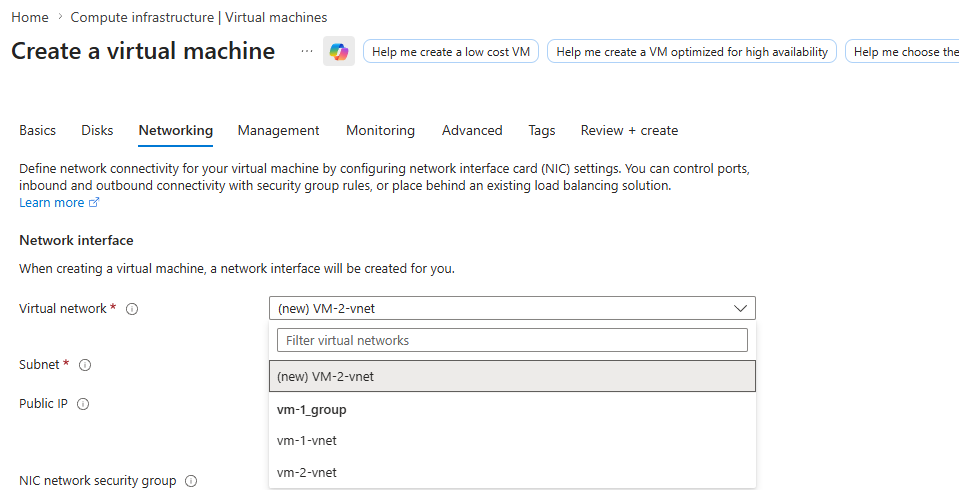
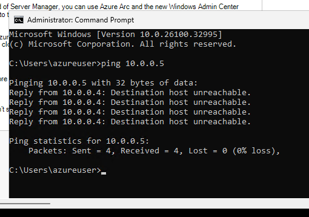
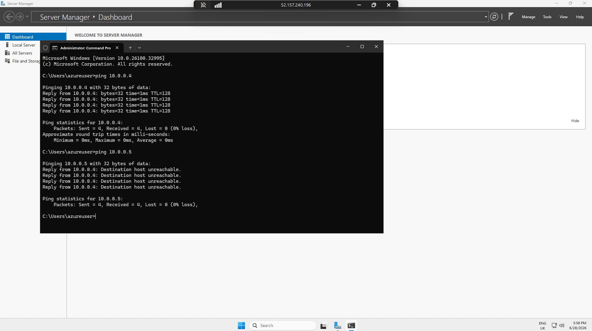
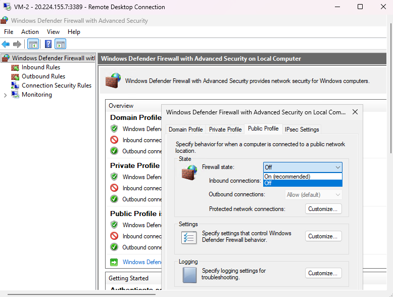
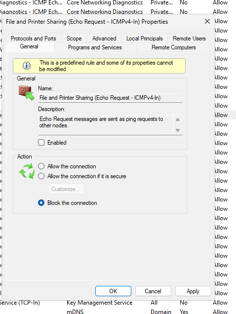
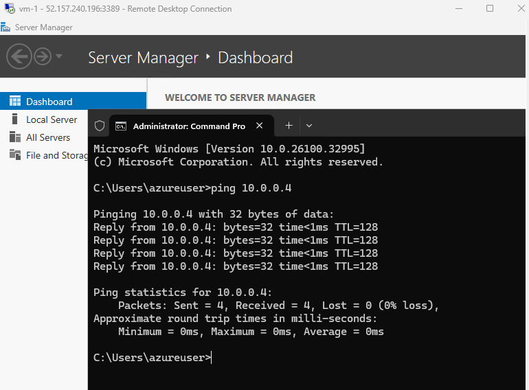

# IT Support Lab

Simulated IT support environment using **Active Directory**, **Jira Ticketing**, and **Azure Cloud Networking**.

---

## Scenario 1 – Sarah Jenkins (Account Disabled)
**Issue:** User unable to log in due to account being disabled.  
**Resolution:** Re-enabled the user account and verified access.  

**Evidence:**  
  

---

## Scenario 2 – Daniel Carter (Password Reset)
**Issue:** User unable to log in due to password issues.  
**Investigation:** Accessed Active Directory, located account, identified password issue.  

**Evidence:**  
  
  

---

## Scenario 3 – Emma Singh (Account Related)

**Evidence:**

 
---

## Scenario 4 – Azure VM Networking & ICMP Troubleshooting
**Objective:** Troubleshoot connectivity between two Azure VMs in different Virtual Networks.

**Steps:**
- Created two Virtual Networks (`vm-1-vnet` and `vm-2-vnet`) and deployed VMs.
- Initial ping test failed (Destination host unreachable).
- Identified blocking rules in NSG and Windows Defender Firewall.
- Added Inbound NSG rule + enabled ICMP in Windows Firewall.
- Retest showed successful ping.

**Evidence:**
  
  
  
  
  
  

**Key Learnings:** Azure NSGs block ICMP by default. Both cloud-level (NSG) and OS-level firewall rules must allow traffic.

---

**Repository Purpose**  
This repository showcases practical IT support documentation, troubleshooting steps, and evidence collection using Active Directory, Jira, and Azure.

---

