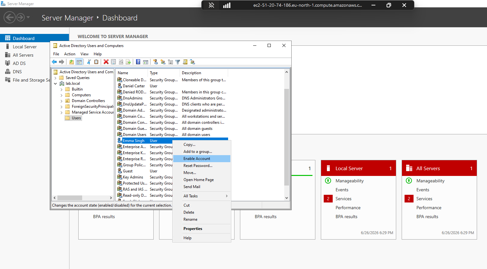
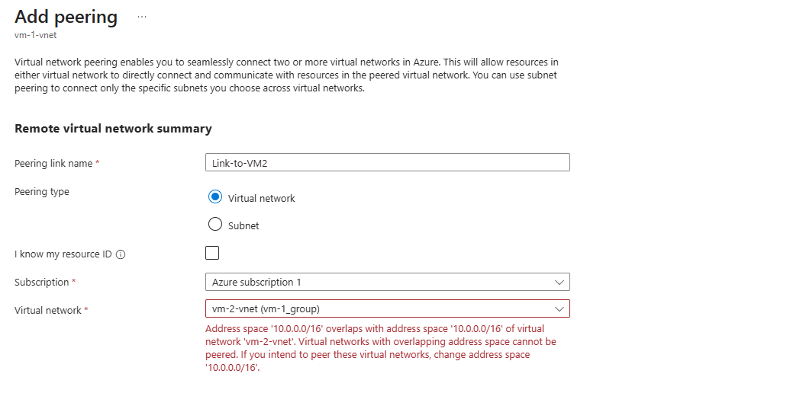
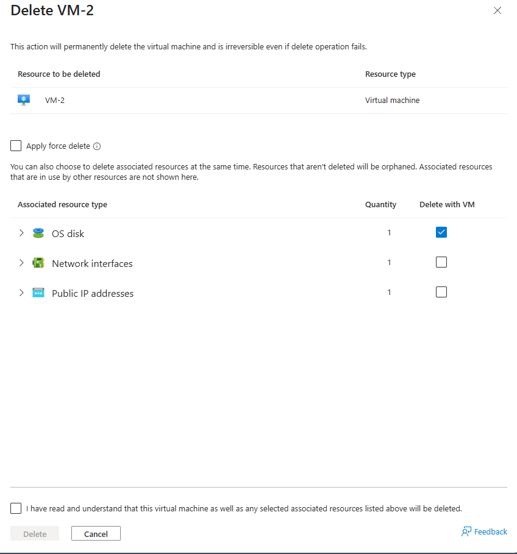

# IT Support Lab

Simulated IT support environment using **Active Directory**, **Jira Ticketing**, and **Azure Cloud Networking**.

---

## Scenario 1 – Sarah Jenkins (Account Disabled)
**Issue:** User unable to log in due to account being disabled.  
**Resolution:** Re-enabled the user account and verified login access.

**Evidence:**  
  

---

## Scenario 2 – Daniel Carter (Password Reset)
**Issue:** User unable to log in due to password issues.  
**Investigation:** Accessed Active Directory, located the user account.  
**Resolution:** Performed password reset and confirmed access.

**Evidence:**  
  
  
 

---

## Scenario 3 – Emma Singh (Account Related)
**Evidence:**  
  
  

---

## Scenario 4: Azure Cross-VNet Routing Failure & Security Hardening

### 📌 Objective
Fix a network connection problem between two Azure Virtual Machines by resolving an IP address conflict, fixing the Virtual Network setup, and changing Windows Firewall rules to allow ping tests safely.

---

### 🛠️ Step-by-Step Walkthrough

#### 1. Finding the Problem
At first, two separate networks were created in the same resource group: `vm-1-vnet` and `vm-2-vnet`. When trying to log into VM-1 and ping the other machine, the connection failed completely with a "Destination host unreachable" error.

When looking at the Azure portal to connect the two networks using **VNet Peering**, a red error message appeared. It showed that both networks were using the exact same IP range (`10.0.0.0/16`), which prevents them from talking to each other:

#### 2. Deleting and Rebuilding the Setup
To fix this overlapping network problem, the broken setup had to be removed. `VM-2` was completely deleted along with its OS disk to clear the way for a clean install.

A new virtual machine was then created. During the **Networking** step of the setup wizard, the new machine was put directly onto `vm-1-vnet` so that both machines shared a working network path.

#### 3. Fixing the Windows Firewall
With both servers finally on the same network layout, the connection paths were open. Instead of unsafely turning off the entire firewall, the target server’s **Windows Defender Firewall** settings were opened using Remote Desktop (RDP). 

The rule for **File and Printer Sharing (Echo Request - ICMPv4-In)** was turned on. The green checkmark confirms that ping requests are now safely allowed through.

#### 4. Final Testing and Proof
A final ping test was sent from VM-1 to the new target. The traffic cleared both the Azure network layer and the internal Windows Firewall successfully, showing a perfect connection with 0% packet loss.

---

### 🧠 Key Learnings
* **Plan IP Ranges Early:** Always make sure different networks use different IP ranges before deploying them so you don't have to delete and restart.
* **Two-Layer Security:** Network traffic in the cloud has to pass two tests: the outer cloud network layer (Azure VNets and Peering) and the inner operating system layer (Windows Firewall). Both must be configured correctly for things to work.
